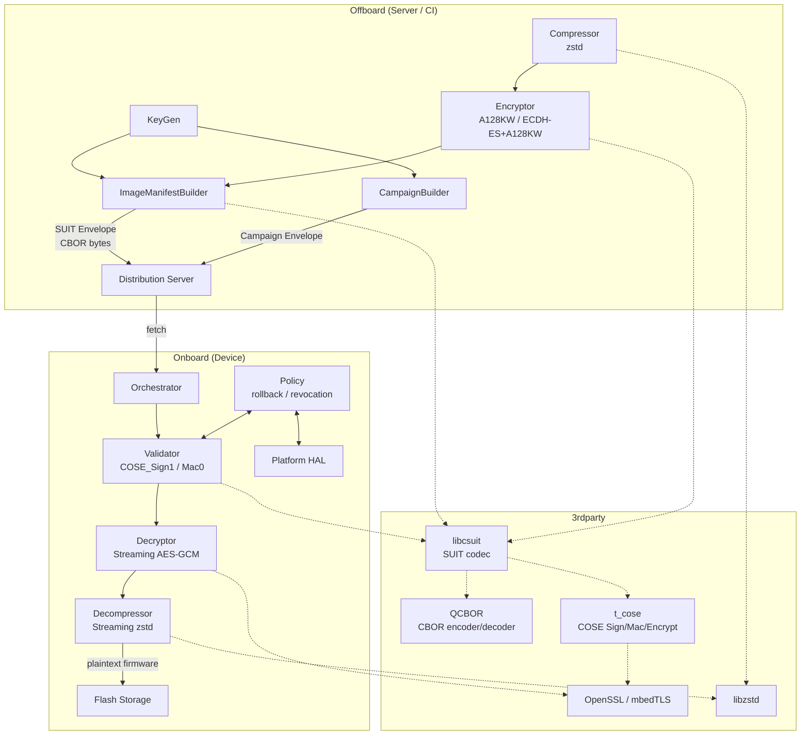
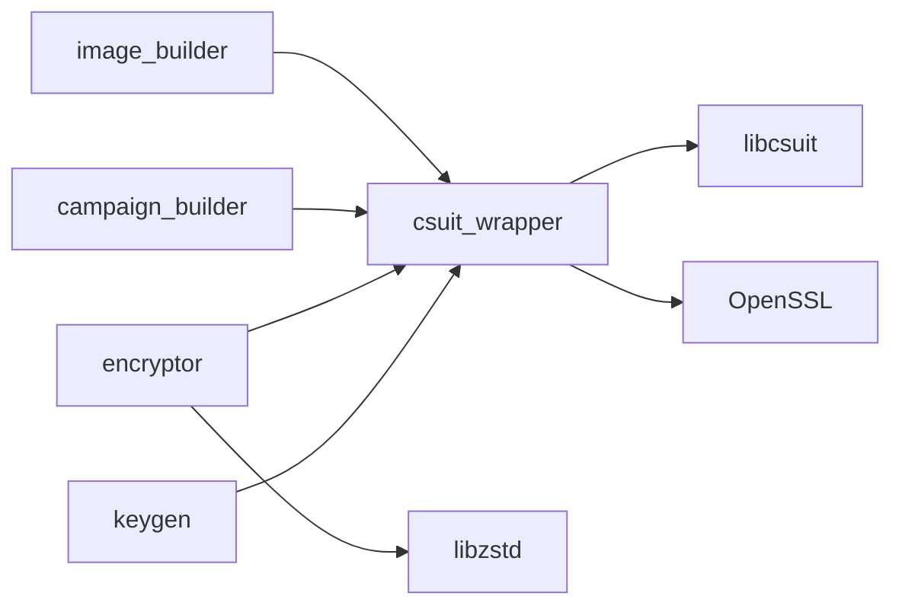
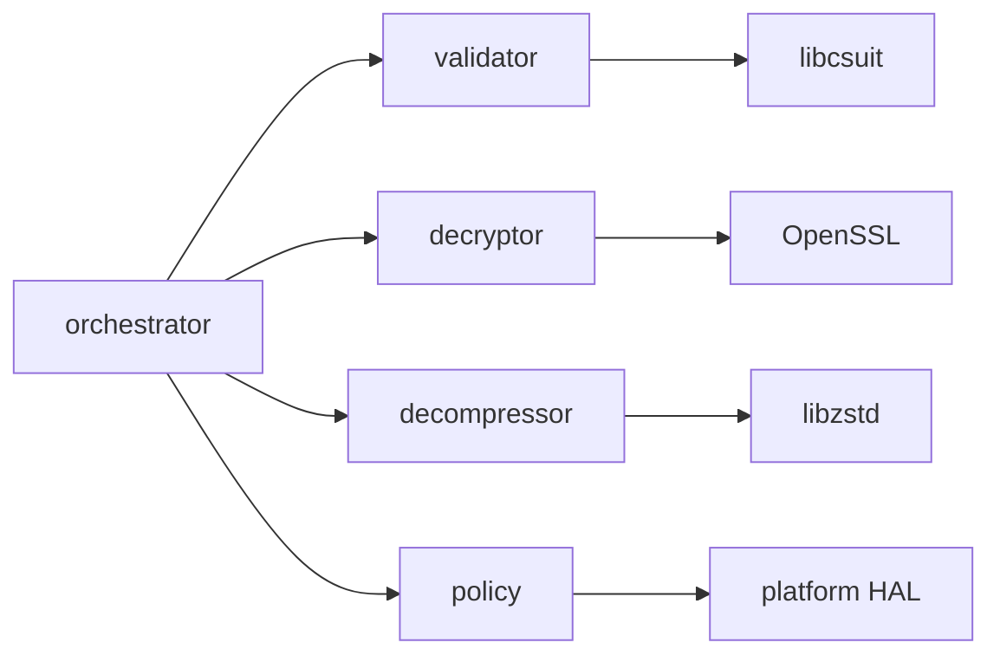
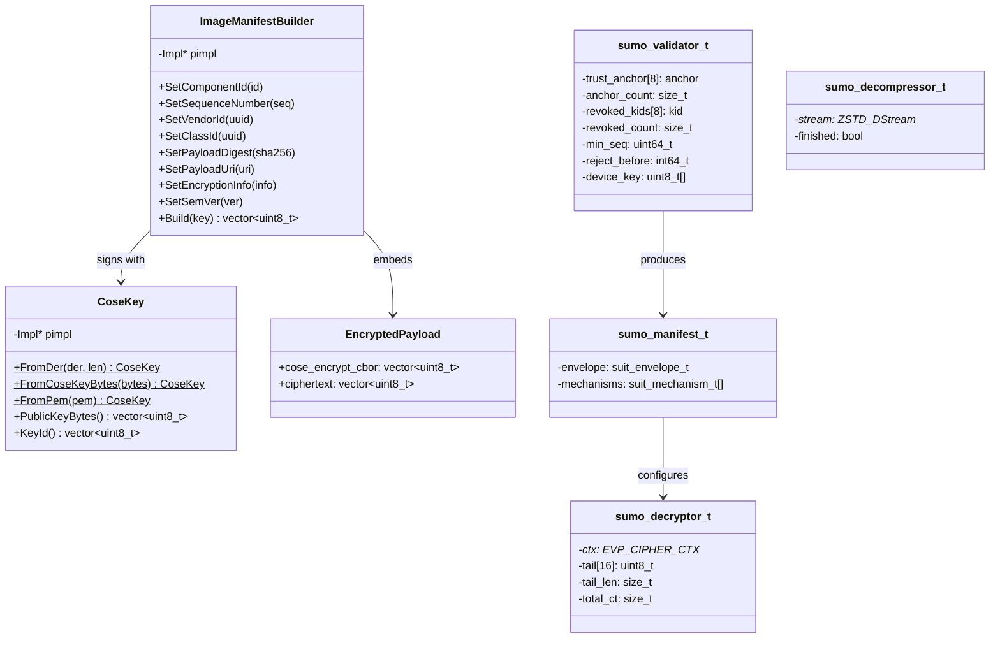
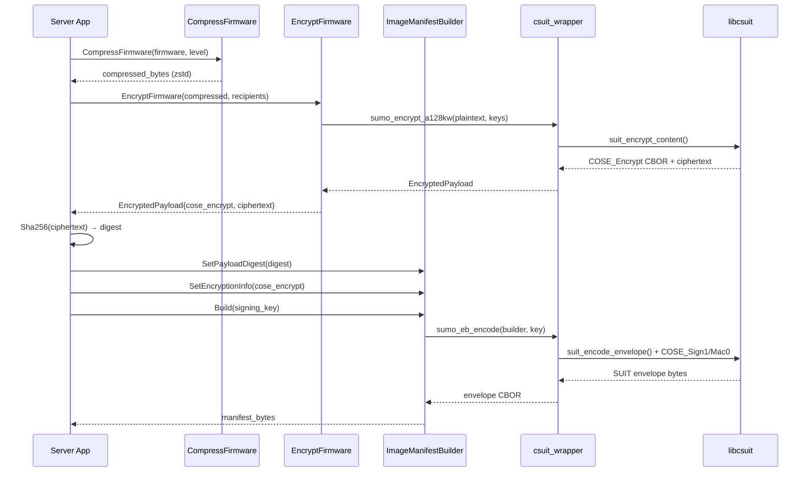
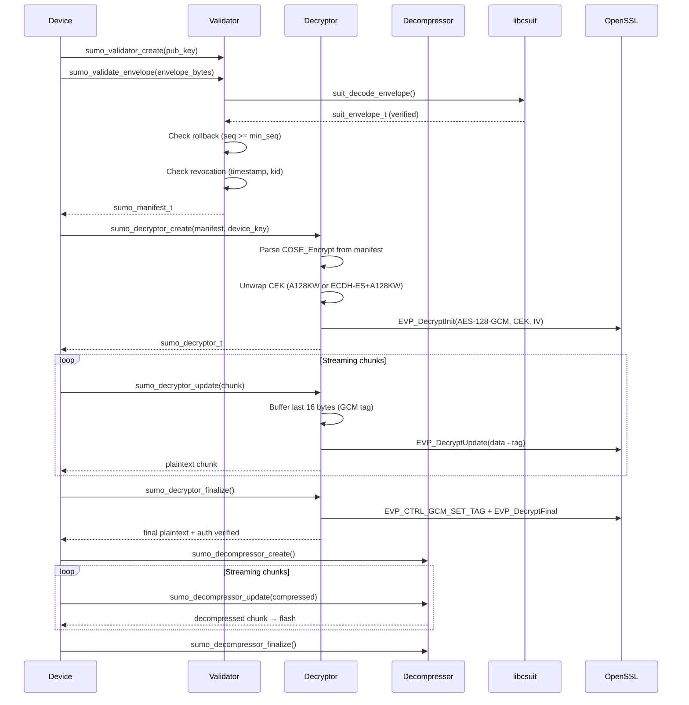
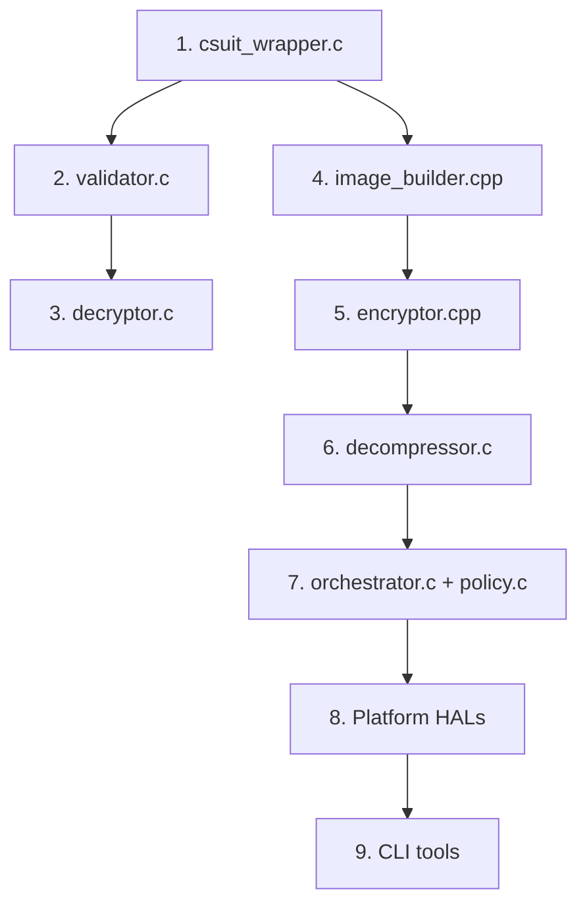

# Architecture: libsumo

## Overview

**libsumo** is a C/C++ library implementing the [SUIT (Software Updates for the Internet of Things)](https://datatracker.ietf.org/doc/rfc9019/) standard for secure firmware updates on constrained devices. It provides two complementary static libraries: an **offboard** server-side component (C++17) for building, signing, and encrypting SUIT manifests, and an **onboard** device-side component (C99) for validating, decrypting, and decompressing firmware payloads. The library targets embedded platforms (ESP32, Zephyr) as well as Linux.

**Stack:** C99 (onboard) + C++20 build / C++17 runtime (offboard), CMake build system, OpenSSL or mbedTLS crypto backend, libcsuit + QCBOR + t_cose (SUIT/CBOR/COSE), zstd compression, GTest for testing.

**Code statistics (project-only, excluding 3rdparty):**

| Language | Files | Code Lines | Comment Lines |
|----------|-------|------------|---------------|
| C        | 11    | 1,486      | 374           |
| C Header | 10    | 428        | 531           |
| C++      | 7     | 1,585      | 319           |
| CMake    | 4     | 147        | 16            |
| Markdown | 3     | ~1,180     | —             |
| **Total**| **43**| **~3,772** | —             |

## Project Structure

```
libsumo/
├── CMakeLists.txt              # Root build: options, 3rdparty integration, subdirectories
├── ARCHITECTURE.md             # This file
├── 3rdparty/
│   └── libcsuit/               # SUIT manifest codec (includes QCBOR, t_cose, mbedtls)
├── offboard/                   # Server-side library (C++17 static lib: sumo_offboard)
│   ├── CMakeLists.txt
│   ├── include/sumo/
│   │   ├── image_builder.h     # L2 ECU image manifest builder
│   │   ├── campaign_builder.h  # L1 campaign manifest builder
│   │   ├── encryptor.h         # Firmware encryption (A128KW, ECDH-ES+A128KW) + compression
│   │   └── keygen.h            # COSE_Key generation (ES256, EdDSA)
│   └── src/
│       ├── image_builder.cpp   # Envelope building via csuit_wrapper
│       ├── campaign_builder.cpp# Campaign manifest (partially implemented)
│       ├── encryptor.cpp       # zstd compression + encrypt delegation to C wrapper
│       ├── keygen.cpp          # Key generation stubs
│       ├── csuit_wrapper.h     # C wrapper header (isolates C++ from libcsuit C conflicts)
│       └── csuit_wrapper.c     # ~390 LOC: envelope encoding, COSE_Encrypt, SHA-256
├── onboard/                    # Device-side library (C99 static lib: sumo_onboard)
│   ├── CMakeLists.txt
│   ├── include/sumo/
│   │   ├── validator.h         # SUIT envelope validation, trust anchors, anti-rollback
│   │   ├── decryptor.h         # Streaming AES-GCM decryption
│   │   ├── decompressor.h      # Streaming zstd decompression
│   │   ├── orchestrator.h      # Two-level manifest processing (campaign + image)
│   │   └── policy.h            # Persistent rollback/revocation policy
│   ├── src/
│   │   ├── validator.c         # ~490 LOC: envelope decode, signature verify, accessor impl
│   │   ├── decryptor.c         # ~890 LOC: COSE_Encrypt parse, A128KW/ECDH unwrap, AES-GCM
│   │   ├── decompressor.c      # ~90 LOC: zstd streaming wrapper
│   │   ├── orchestrator.c      # ~80 LOC: campaign/image processing (stubs)
│   │   └── policy.c            # ~55 LOC: load/save sequence numbers
│   └── platform/
│       ├── platform_linux.c    # File-backed storage (stub)
│       ├── platform_esp32.c    # ESP-IDF NVS storage (stub)
│       └── platform_zephyr.c   # Zephyr settings (stub)
├── tests/
│   ├── CMakeLists.txt
│   ├── e2e/e2e_test.cpp        # ~690 LOC: full pipeline tests (build → encrypt → validate → decrypt)
│   └── onboard/
│       ├── validator_test.cpp  # ~560 LOC: validation, rollback, revocation tests
│       ├── decryptor_test.cpp  # ~400 LOC: AES-GCM streaming, A128KW key unwrap tests
│       ├── decryptor_test_helper.c # Mac0 envelope decode helper
│       └── size_test.c         # Binary size measurement harness
├── examples/                   # Placeholder directories (encode/, parser/, process/)
├── tools/                      # Placeholder (CLI tools, not yet implemented)
└── refs/                       # IETF RFCs and design documents
    ├── LIBRARY_DESIGN.md       # Architecture decisions, migration plan
    └── FEATURE_MAPPING.md      # libsum → SUIT gap analysis
```

## System Architecture



## Module Hierarchy

### Offboard Modules



| Module | Purpose | Key Exports |
|--------|---------|-------------|
| `image_builder` | Fluent builder for L2 ECU image manifests | `ImageManifestBuilder`, `CoseKey`, `SemVer`, `Uuid` |
| `campaign_builder` | Fluent builder for L1 campaign manifests | `CampaignBuilder`, `ImageDependency` |
| `encryptor` | Firmware encryption + zstd compression | `EncryptFirmware()`, `EncryptFirmwareEcdh()`, `CompressFirmware()`, `Sha256()` |
| `keygen` | COSE_Key generation (ES256, EdDSA) | `GenerateSigningKey()`, `GenerateDeviceKey()`, `SerializeKey()` |
| `csuit_wrapper` | C bridge isolating C++ from libcsuit naming conflicts | `sumo_eb_*()`, `sumo_encrypt_*()`, `sumo_sha256()` |

### Onboard Modules



| Module | Purpose | Key Exports |
|--------|---------|-------------|
| `validator` | SUIT envelope validation, signature verification, anti-rollback | `sumo_validator_t`, `sumo_manifest_t`, `sumo_validate_envelope()`, manifest accessors |
| `decryptor` | Streaming AES-128-GCM with COSE_Encrypt key unwrap | `sumo_decryptor_t`, `sumo_decryptor_create/update/finalize/free()` |
| `decompressor` | Streaming zstd decompression | `sumo_decompressor_t`, `sumo_decompressor_create/update/finalize/free()` |
| `orchestrator` | Two-level manifest processing pipeline | `sumo_process_campaign()`, `sumo_process_image()` |
| `policy` | Persistent rollback counters and revocation timestamps | `sumo_policy_load()`, `sumo_policy_save()` |
| `platform_*` | Platform HAL implementations | Storage + fetch callbacks (stubs) |

## Core Types



## Data Flow

### Flow 1: Build Encrypted SUIT Manifest (Offboard)



### Flow 2: Validate & Decrypt Firmware (Onboard)



### Flow 3: End-to-End Pipeline (from E2E tests)

```mermaid
sequenceDiagram
    participant Test as E2E Test
    participant Off as Offboard API
    participant On as Onboard API

    Test->>Off: CompressFirmware(1MB firmware)
    Off-->>Test: compressed (zstd)
    Test->>Off: EncryptFirmware(compressed, [kek])
    Off-->>Test: {cose_encrypt, ciphertext}
    Test->>Off: Sha256(ciphertext) → digest
    Test->>Off: ImageManifestBuilder.Build(mac_key)
    Off-->>Test: SUIT envelope

    Test->>On: sumo_validator_create(mac_key)
    Test->>On: sumo_validate_envelope(envelope)
    On-->>Test: manifest handle

    Test->>On: sumo_decryptor_create(manifest, kek)
    loop 4KB streaming chunks
        Test->>On: sumo_decryptor_update(chunk)
        On-->>Test: plaintext chunk (SHA-256 incremental)
    end
    Test->>On: sumo_decryptor_finalize()

    Test->>On: sumo_decompressor_create()
    loop streaming decompression
        Test->>On: sumo_decompressor_update(chunk)
        On-->>Test: decompressed chunk
    end
    Test->>On: sumo_decompressor_finalize()

    Test->>Test: Assert decompressed == original firmware
```

## State Management

| State | Type | Location | Written By | Read By |
|-------|------|----------|-----------|---------|
| Trust anchors | `{kid, pubkey}[8]` | `sumo_validator_t` | `sumo_validator_add_trust_anchor()` | `sumo_validate_envelope()` |
| Revoked key IDs | `kid[8]` | `sumo_validator_t` | `sumo_validator_revoke_kid()` | `sumo_validate_envelope()` |
| Min sequence number | `uint64_t` | `sumo_validator_t` | `sumo_validator_set_min_sequence()` | `sumo_validate_envelope()` |
| Reject-before timestamp | `int64_t` | `sumo_validator_t` | `sumo_validator_set_reject_before()` | `sumo_validate_envelope()` |
| Device key | `uint8_t[32]` | `sumo_validator_t` | `sumo_validator_add_device_key()` | `sumo_decryptor_create()` |
| Parsed envelope | `suit_envelope_t` | `sumo_manifest_t` | `sumo_validate_envelope()` | Manifest accessors, decryptor |
| AES-GCM cipher state | `EVP_CIPHER_CTX*` | `sumo_decryptor_t` | `sumo_decryptor_create()` | `_update()`, `_finalize()` |
| GCM tag buffer | `uint8_t[16]` | `sumo_decryptor_t` | `sumo_decryptor_update()` | `sumo_decryptor_finalize()` |
| Zstd stream state | `ZSTD_DStream*` | `sumo_decompressor_t` | `sumo_decompressor_create()` | `_update()`, `_finalize()` |
| Persistent rollback counters | `uint64_t` | Platform NVS | `sumo_policy_save()` | `sumo_policy_load()` |

**Lifecycle:** All opaque types follow a `create → use → free` pattern. No global or shared mutable state exists. All state is instance-scoped and thread-local (no locks needed if instances are not shared).

## API / Command Reference

### Offboard API (C++, namespace `sumo`)

| Function / Class | Parameters | Returns | Description |
|-----------------|------------|---------|-------------|
| `CoseKey::FromDer()` | `uint8_t*, size_t` | `CoseKey` | Import key from DER bytes |
| `CoseKey::FromCoseKeyBytes()` | `vector<uint8_t>` | `CoseKey` | Import from COSE_Key CBOR |
| `CoseKey::FromPem()` | `string` | `CoseKey` | Import from PEM string |
| `ImageManifestBuilder` | fluent setters | `vector<uint8_t>` via `Build()` | Build SUIT L2 image manifest |
| `CampaignBuilder` | fluent setters | `vector<uint8_t>` via `Build()` | Build SUIT L1 campaign manifest (WIP) |
| `EncryptFirmware()` | `plaintext, recipients[]` | `EncryptedPayload` | AES-128-GCM + A128KW wrap |
| `EncryptFirmwareEcdh()` | `plaintext, sender_key, recipients[]` | `EncryptedPayload` | AES-128-GCM + ECDH-ES+A128KW |
| `CompressFirmware()` | `data, level=3` | `vector<uint8_t>` | zstd compression |
| `Sha256()` | `data` | `vector<uint8_t>` (32 bytes) | SHA-256 hash |
| `GenerateSigningKey()` | `Algorithm` | `CoseKey` | Generate signing keypair (stub) |
| `GenerateDeviceKey()` | `Algorithm` | `CoseKey` | Generate device keypair (stub) |

### Onboard API (C99)

| Function | Parameters | Returns | Description |
|----------|------------|---------|-------------|
| `sumo_validator_create()` | `key, key_len, device_id*` | `sumo_validator_t*` | Create validator with initial trust anchor |
| `sumo_validator_add_trust_anchor()` | `v, kid, kid_len, key, key_len` | `sumo_err_t` | Add additional trust anchor (up to 8) |
| `sumo_validator_revoke_kid()` | `v, kid, kid_len` | `sumo_err_t` | Revoke a signing key by ID |
| `sumo_validator_add_device_key()` | `v, key, key_len` | `sumo_err_t` | Set device decryption key |
| `sumo_validator_set_min_sequence()` | `v, seq` | `void` | Set anti-rollback minimum |
| `sumo_validator_set_reject_before()` | `v, timestamp` | `void` | Set revocation cutoff time |
| `sumo_validate_envelope()` | `v, data, len` | `sumo_manifest_t*` | Validate + parse SUIT envelope |
| `sumo_manifest_sequence_number()` | `m` | `uint64_t` | Get manifest sequence number |
| `sumo_manifest_component_count()` | `m` | `size_t` | Number of components |
| `sumo_manifest_vendor_id()` | `m, idx, out` | `sumo_err_t` | Get vendor UUID for component |
| `sumo_manifest_class_id()` | `m, idx, out` | `sumo_err_t` | Get class UUID for component |
| `sumo_manifest_image_digest()` | `m, idx, out, out_len` | `sumo_err_t` | Get image SHA-256 digest |
| `sumo_manifest_image_size()` | `m, idx` | `uint64_t` | Get expected image size |
| `sumo_manifest_version()` | `m, idx, out` | `sumo_err_t` | Get SemVer version |
| `sumo_manifest_text_*()` | `m, out, out_len` | `sumo_err_t` | Get text fields (vendor, model, etc.) |
| `sumo_decryptor_create()` | `manifest, comp_idx, key, key_len` | `sumo_decryptor_t*` | Create streaming decryptor from manifest encryption info |
| `sumo_decryptor_update()` | `d, in, in_len, out, out_len` | `sumo_err_t` | Decrypt chunk (buffers GCM tag) |
| `sumo_decryptor_finalize()` | `d, out, out_len` | `sumo_err_t` | Verify GCM tag + flush |
| `sumo_decompressor_create()` | — | `sumo_decompressor_t*` | Create streaming zstd decompressor |
| `sumo_decompressor_update()` | `d, in, in_len, out, out_len` | `sumo_err_t` | Decompress chunk |
| `sumo_decompressor_finalize()` | `d` | `sumo_err_t` | Verify frame ended cleanly |
| `sumo_process_campaign()` | `v, data, ops` | `sumo_err_t` | Process L1 campaign (stub) |
| `sumo_process_image()` | `v, data, ops` | `sumo_err_t` | Process L2 image (stub) |
| `sumo_policy_load()` | `v, storage_ops` | `sumo_err_t` | Load rollback state from NVS |
| `sumo_policy_save()` | `manifest, storage_ops` | `sumo_err_t` | Persist sequence numbers (stub) |

### Error Codes (`sumo_err_t`)

| Code | Name | Meaning |
|------|------|---------|
| 0 | `SUMO_OK` | Success |
| -1 | `SUMO_ERR_NOMEM` | Allocation failure |
| -2 | `SUMO_ERR_INVALID` | Invalid input / malformed data |
| -3 | `SUMO_ERR_AUTH` | Signature / MAC verification failed |
| -4 | `SUMO_ERR_ROLLBACK` | Sequence number too low |
| -5 | `SUMO_ERR_REVOKED` | Signing key revoked |
| -6 | `SUMO_ERR_CRYPTO` | Crypto operation failed |
| -7 | `SUMO_ERR_UNSUPPORTED` | Feature not implemented |
| -8 | `SUMO_ERR_IO` | I/O / platform callback failure |

## External Dependencies

### Runtime Dependencies

| Dependency | Version | Purpose | Replaceable? |
|-----------|---------|---------|-------------|
| **libcsuit** | vendored (3rdparty) | SUIT manifest encode/decode, COSE Sign/Mac/Encrypt | No — core protocol |
| **QCBOR** | vendored (via libcsuit) | CBOR encoding/decoding | No — required by libcsuit |
| **t_cose** | vendored (via libcsuit) | COSE_Sign1, COSE_Mac0, COSE_Encrypt | No — required by libcsuit |
| **OpenSSL** | system (default) | AES-GCM, SHA-256, ECDH, key operations | Yes → mbedTLS (build option) |
| **mbedTLS** | vendored (optional) | Alternative crypto backend for constrained devices | Yes → OpenSSL |
| **libzstd** | system (pkg-config) | Firmware compression/decompression | Could swap for LZ4, but zstd preferred |

### Build / Test Dependencies

| Dependency | Purpose |
|-----------|---------|
| CMake >= 3.14 | Build system |
| GTest | Unit + E2E testing |
| pkg-config | Find system libzstd |
| make | Build libcsuit (ExternalProject) |

## Design Patterns & Decisions

### Patterns

| Pattern | Where | Why |
|---------|-------|-----|
| **Opaque pointer (pimpl)** | All onboard types (`sumo_*_t`), offboard `CoseKey`/builders | Hide implementation details, stable ABI, C99 compatibility |
| **Streaming processor** | `decryptor`, `decompressor` | Constant memory on constrained devices — never buffers entire firmware |
| **Fluent builder** | `ImageManifestBuilder`, `CampaignBuilder` | Ergonomic C++ API for manifest construction |
| **C wrapper bridge** | `csuit_wrapper.c/.h` | libcsuit uses C identifiers that conflict with C++ keywords (`delete`); wrapper isolates this |
| **Platform HAL** | `sumo_platform_ops_t`, `sumo_storage_ops_t` | Portable across ESP32, Zephyr, Linux via function pointer tables |
| **Create/use/free lifecycle** | All opaque types | No RAII in C99; explicit resource management |
| **GCM tag tail-buffering** | `decryptor.c` | Last 16 bytes of COSE_Encrypt ciphertext are the GCM auth tag, not ciphertext. The decryptor holds back 16 bytes during streaming to split data from tag at finalize. |

### Key Decisions

1. **Two-level manifest architecture**: L1 campaign manifests reference multiple L2 image manifests via SUIT dependencies, enabling multi-ECU updates from a single campaign.
2. **C99 onboard / C++17 offboard split**: Devices run pure C99 (no allocator pressure, no exceptions). Servers get ergonomic C++ with STL containers and RAII.
3. **Vendored libcsuit**: SUIT protocol codec is vendored as a git submodule to ensure reproducible builds and pin to a tested version.
4. **OpenSSL as default crypto**: Faster development on Linux; mbedTLS available for constrained targets via `SUMO_CRYPTO_MBEDTLS` CMake option.
5. **No global state**: All state is instance-scoped. Thread-safe by isolation (each thread gets its own validator/decryptor).
6. **Fixed-size trust anchor / revocation arrays**: Max 8 trust anchors and 8 revoked kids — avoids dynamic allocation on constrained devices.

### Implementation Status

| Feature | Status |
|---------|--------|
| Image manifest building (offboard) | Done |
| Firmware encryption (A128KW) | Done |
| Firmware encryption (ECDH-ES+A128KW) | Done |
| zstd compression | Done |
| SHA-256 digest | Done |
| Envelope validation (onboard) | Done |
| Anti-rollback enforcement | Done |
| Key revocation | Done |
| Timestamp-based revocation | Done |
| Manifest accessors | Done |
| Streaming AES-GCM decryption | Done |
| Streaming zstd decompression | Done |
| Campaign manifest building | Stub (not yet implemented) |
| Key generation | Stub |
| Orchestrator (campaign + image) | Stub |
| Policy persistence | Partial (load works, save stub) |
| Platform HALs | Stubs |
| CLI tools | Not started |
| Examples | Not started |

## Recreation Blueprint

### 1. Project Scaffolding

```bash
mkdir -p libsumo/{offboard/{include/sumo,src},onboard/{include/sumo,src,platform},tests/{e2e,onboard},3rdparty,tools,examples}
# Clone libcsuit into 3rdparty/
git submodule add <libcsuit-url> 3rdparty/libcsuit
# Create root CMakeLists.txt with ExternalProject for libcsuit
```

**Prerequisites:** OpenSSL dev headers, libzstd dev, GTest, CMake >= 3.14, make.

### 2. Core Types to Define First

1. **Error codes** (`sumo_err_t`) — shared between onboard and offboard
2. **`sumo_validator_t`** — the anchor for all onboard operations
3. **`sumo_manifest_t`** — wraps libcsuit's `suit_envelope_t`
4. **`CoseKey`** (offboard) — wraps OpenSSL EVP_PKEY or COSE_Key bytes

### 3. Build Order



**Phase 1 — C Wrapper + Validation:**
- Implement `csuit_wrapper.c` with envelope encoding via libcsuit
- Implement `validator.c` with `suit_decode_envelope()` + signature verification
- Write `validator_test.cpp` against libcsuit test vectors (exp0, exp1, exp2A)

**Phase 2 — Streaming Decryption:**
- Implement `decryptor.c`: Parse COSE_Encrypt CBOR, unwrap A128KW CEK, streaming AES-GCM
- Critical detail: tail-buffer last 16 bytes during `update()` — GCM tag is appended to ciphertext
- Write `decryptor_test.cpp` against libcsuit's expAW test vector

**Phase 3 — Offboard Builders:**
- Implement `ImageManifestBuilder` with pimpl wrapping `csuit_wrapper`
- Implement `EncryptFirmware()` delegating to `sumo_encrypt_a128kw()`
- Add ECDH-ES+A128KW support via `sumo_encrypt_esdh()`

**Phase 4 — Compression:**
- Implement `decompressor.c` wrapping `ZSTD_DStream`
- Implement `CompressFirmware()` in `encryptor.cpp`

**Phase 5 — E2E Tests:**
- Write `e2e_test.cpp` exercising full build → encrypt → validate → decrypt → decompress pipeline
- Test with 1MB firmware, 4KB streaming chunks, verify round-trip fidelity

**Phase 6 — Campaign + Orchestration (TODO):**
- Implement `CampaignBuilder::Build()` with SUIT dependency resolution
- Implement `sumo_process_campaign()` and `sumo_process_image()` in orchestrator
- Complete platform HAL implementations

### 4. Configuration & Environment

```bash
# Build (default: OpenSSL, onboard + offboard, no tests)
cmake -B build -DSUMO_BUILD_TESTS=ON
cmake --build build

# Run tests
cd build && ctest --output-on-failure

# For mbedTLS backend:
cmake -B build -DSUMO_CRYPTO_MBEDTLS=ON -DSUMO_CRYPTO_OPENSSL=OFF

# For ESP32 (cross-compile):
cmake -B build -DSUMO_PLATFORM_ESP32=ON -DSUMO_BUILD_OFFBOARD=OFF
```

### 5. Testing Approach

- **Unit tests:** Test each module in isolation (validator against known test vectors, decryptor against OpenSSL reference, decompressor against zstd reference)
- **E2E tests:** Full pipeline — offboard builds manifest + encrypts, onboard validates + decrypts + decompresses, assert round-trip equality
- **Size test:** Compile minimal binary to measure flash footprint on constrained targets
- **Test vectors:** Reuse libcsuit's test files in `3rdparty/libcsuit/testfiles/` (exp0, exp1, exp2A, expAW, etc.)
